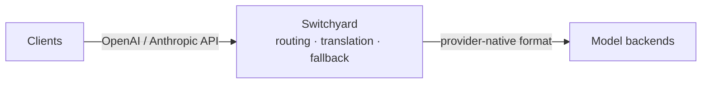

<p align="center">
  
</p>

# Switchyard

Switchyard is a Rust proxy and library for LLM traffic. It routes requests
across providers, translates between OpenAI and Anthropic APIs, records
operational metrics, and provides typed, composable routing algorithms.

**Why Switchyard?** Point a coding agent such as Claude Code or Codex at an
open-source model. Switchyard translates between the OpenAI Chat, Anthropic
Messages, and OpenAI Responses formats, so the agent keeps speaking its native
API while the request is served by vLLM, NVIDIA NIM, Ollama, or any
OpenAI-compatible endpoint. The same proxy can spread traffic across several
models for A/B benchmarking, apply signal-driven stage routing, or run a custom
algorithm you write yourself.

## Features

- **Protocol Translation**: convert between OpenAI Chat, Anthropic Messages, and OpenAI Responses formats
- **Multi-Backend Routing**: random routing, LLM-as-classifier routing, signal-driven stage-router, or your own algorithm
- **Operational Metrics**: Prometheus metrics cover requests, errors, latency, tokens, and routing overhead

## Quick Start

Choose the launcher path to run Claude Code, Codex CLI, or OpenClaw through
Switchyard. Choose the server path to run Switchyard as a standalone proxy.

### Launcher Path

Install [`uv`](https://docs.astral.sh/uv/getting-started/installation/) if it is
not already available, then install the published Switchyard tool:

```bash
curl -LsSf https://astral.sh/uv/install.sh | sh
source "$HOME/.local/bin/env"
uv tool install --python 3.12 "nemo-switchyard[cli,server]"
```

The coding agent you launch must also be installed and on your `PATH`. This does
not install the standalone `switchyard-server` binary; use the Server Path for
that.

Set an OpenRouter key and launch against the packaged deployment:

```bash
export OPENROUTER_API_KEY="your-openrouter-key"  # pragma: allowlist secret
switchyard launch claude --model switchyard
switchyard launch codex --model switchyard
switchyard launch openclaw --model switchyard
```

To use your own native TOML deployment, pass its route ID and configuration:

```bash
switchyard launch claude --model my-route --config routes.toml
```

### Server Path

Use this path to build and run the standalone Rust proxy. Install
[Rust with Cargo](https://rust-lang.org/tools/install/), then build the release
binary from source:

```bash
git clone https://github.com/NVIDIA-NeMo/Switchyard.git
cd Switchyard
cargo build --locked --release -p switchyard-server
./target/release/switchyard-server --help
```

Prebuilt binaries are not published yet. `rustup` installs the pinned toolchain
automatically when you run Cargo from the repository.

Create `routes.toml` using the
[Getting Started guide](docs/getting_started.md#server-path), then validate it
and start the server:

```bash
export OPENROUTER_API_KEY="your-openrouter-key"  # pragma: allowlist secret
./target/release/switchyard-server --config routes.toml --dry-run
./target/release/switchyard-server --config routes.toml --host 127.0.0.1 --port 4000
```

Verify the proxy in another terminal:

```bash
curl http://localhost:4000/health
```

For a complete configuration and a test request, follow
[Getting Started](docs/getting_started.md).

## Architecture



Clients keep their native OpenAI or Anthropic API format. Switchyard picks a
configured backend, forwards the request in that backend's own format, and
translates the response back into the shape the client expects. The server
accepts OpenAI Chat Completions, OpenAI Responses, and Anthropic Messages. Each
configured LLM client selects one upstream format.

## Documentation

- **[Getting Started](docs/getting_started.md)**: complete launcher and standalone server walkthroughs
- **[Core Concepts](docs/core_concepts.md)**: LLM clients, targets, routes, model IDs, and routing algorithms
- **[Routing Overview](docs/routing_algorithms/overview.md)**: choose and configure a routing algorithm
- **[`switchyard-server`](crates/switchyard-server/README.md)**: server configuration, routing algorithms, and metrics
- **[`switchyard-libsy`](crates/libsy/README.md)**: embed routing algorithms in a Rust application
- **[`switchyard-protocol`](crates/protocol/README.md)**: provider-neutral request, response, and streaming types
- **[`switchyard-translation`](crates/switchyard-translation/README.md)**: request, response, and stream translation

## Community

- **Issues**: [GitHub Issues](https://github.com/NVIDIA-NeMo/Switchyard/issues)
- **Code of Conduct**: [Code of Conduct](CODE_OF_CONDUCT.md)

## License

[Apache 2.0 License](LICENSE). Copyright NVIDIA Corporation.
